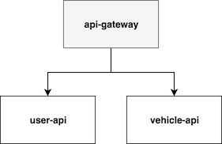
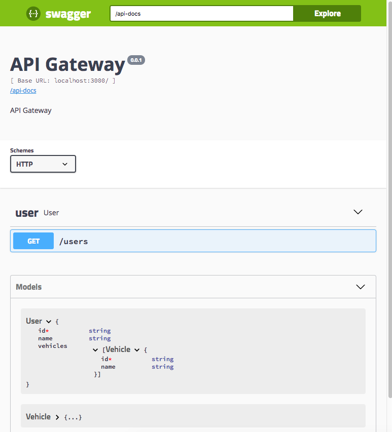
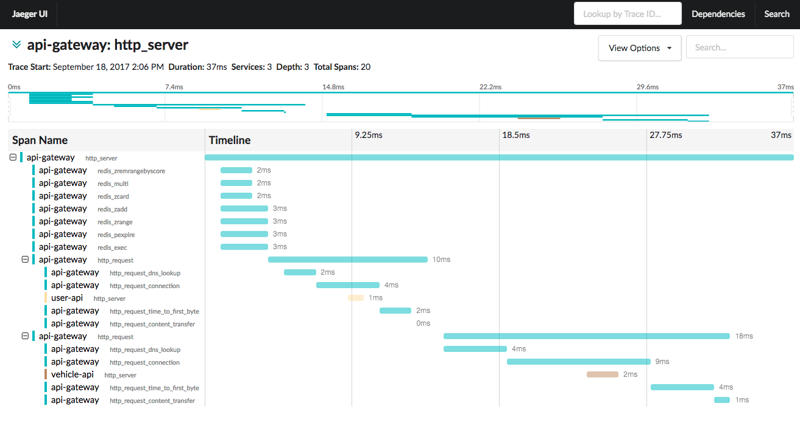

# Microservices​ ​with​ ​Node.js​ ​and​ ​Kubernetes​

Demonstrating a HTTP based microservices and API gateway with Kubernetes and Helm.

## Getting Started

- [Azure Container Service](/docs/azure.md)
- [Docker Compose](/docs/docker-compose.md)
- [Minikube](/docs/minikube.md)

## Docs

http://localhost:3000/docs

## Distributed Tracing

http://localhost:16686

